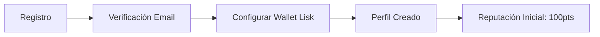
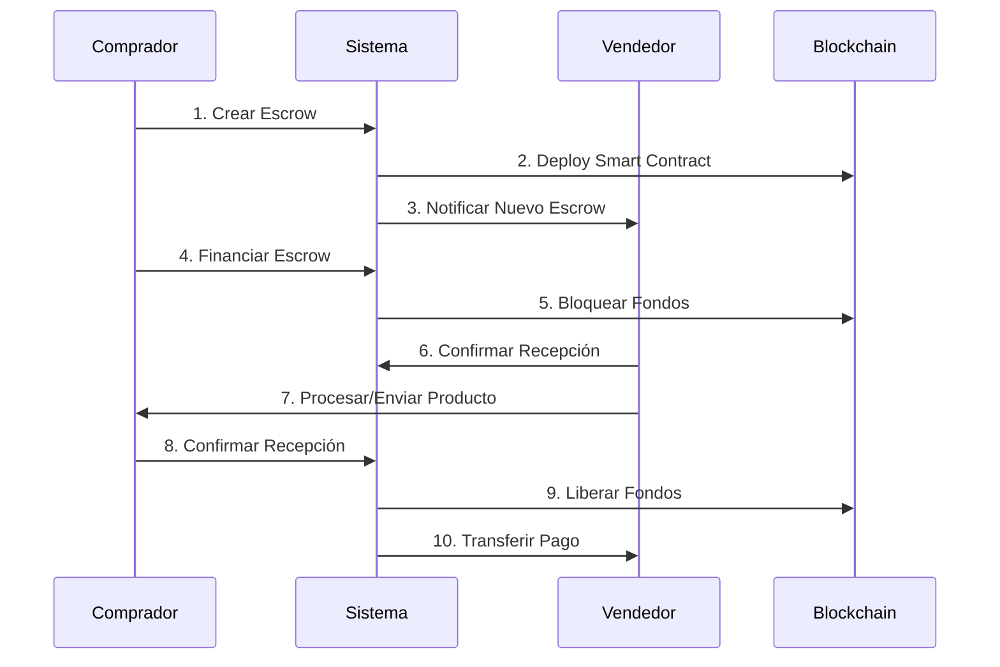
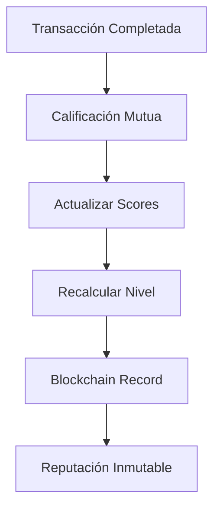
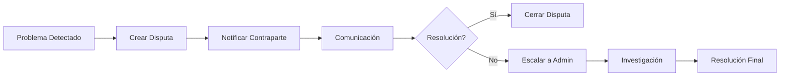

# 📊 Análisis Completo: Lisk TrustPay

## 🎯 **Resumen Ejecutivo**

**Lisk TrustPay** es una pasarela de pagos Web3 que utiliza contratos de escrow inteligentes en blockchain Lisk para resolver problemas críticos de confianza en transacciones digitales en Latinoamérica. La aplicación actúa como intermediario seguro entre compradores y vendedores, bloqueando fondos hasta que se confirme la entrega satisfactoria del producto o servicio.

---

## 🔍 **Problemática Identificada**

### **Problemas Actuales en LATAM:**
1. **Apps de Delivery**: Pedidos no entregados, robados o productos incorrectos
2. **Ventas por Redes Sociales**: Desconfianza mutua entre vendedores y compradores
3. **Marketplaces P2P**: Falta de garantías en transacciones entre particulares
4. **Freelancing**: Pagos no realizados después de completar trabajos
5. **E-commerce**: Estafas tanto a compradores como vendedores

### **Impacto del Problema:**
- **Pérdidas económicas** estimadas en millones de dólares anuales
- **Barreras de adopción** para comercio electrónico
- **Desconfianza generalizada** en plataformas digitales
- **Limitación del crecimiento** del ecosistema digital en LATAM

---

## 🏗️ **Arquitectura Tecnológica Completa**

### **Stack Tecnológico**
```
Frontend: Next.js + TypeScript + Tailwind CSS
Backend: Node.js + Express + TypeScript
Database: MongoDB + Mongoose
Blockchain: Lisk L2 + Smart Contracts
Authentication: JWT + bcrypt
API: RESTful + WebSockets (futuro)
Testing: Postman Collection Completa
```

### **Estructura de Microservicios**
```
🔐 Auth Service          → Autenticación y autorización
💰 Escrow Service       → Lógica de contratos de custodia
⭐ Reputation Service   → Sistema de calificaciones
⚖️ Dispute Service     → Resolución de conflictos
🔗 Lisk Service        → Integración blockchain
📧 Notification Service → Comunicaciones en tiempo real
```

---

## 🔄 **Flujos Funcionales Detallados**

### **1. Flujo de Autenticación y Onboarding**



**Endpoints involucrados:**
- `POST /api/v1/auth/register` - Registro de usuario
- `POST /api/v1/auth/login` - Inicio de sesión
- `GET /api/v1/auth/profile` - Obtener perfil
- `PUT /api/v1/auth/profile` - Actualizar perfil
- `GET /api/v1/auth/wallet` - Información de wallet

**Datos requeridos:**
```json
{
  "email": "usuario@example.com",
  "password": "password123",
  "username": "usuario_unico",
  "liskAddress": "lsk24cd35u4jdq8szo4pnsqe5dsxwrnazyqqqg5eu",
  "publicKey": "a665a45920422f9d417e4867efdc4fb8a04a1f3fff1fa07e998e86f7f7a27ae3"
}
```

### **2. Flujo Completo de Escrow (Transacción Segura)**



**2.1 Creación de Escrow**
- **Endpoint**: `POST /api/v1/escrow`
- **Datos**: Vendedor, monto, descripción, términos, info del producto
- **Generación automática**: ID único, contrato blockchain, fechas límite

**2.2 Financiamiento**
- **Endpoint**: `POST /api/v1/escrow/{escrowId}/fund`
- **Acción**: Fondos bloqueados hasta confirmación de entrega
- **Estados**: `CREATED` → `FUNDED`

**2.3 Comunicación Interna**
- **Endpoint**: `POST /api/v1/escrow/{escrowId}/message`
- **Funcionalidad**: Chat seguro entre comprador y vendedor
- **Endpoint**: `GET /api/v1/escrow/{escrowId}/messages`

**2.4 Liberación de Fondos**
- **Endpoint**: `POST /api/v1/escrow/{escrowId}/release`
- **Condiciones**: Aprobación buyer/seller, auto-release configurable
- **Estados**: `FUNDED` → `COMPLETED`

### **3. Sistema de Reputación Inmutable**



**Endpoints del Sistema de Reputación:**
- `POST /api/v1/reputation/rate` - Crear calificación
- `GET /api/v1/reputation/{userId}` - Obtener reputación de usuario
- `GET /api/v1/reputation/{userId}/history` - Historial de calificaciones
- `GET /api/v1/reputation/escrow/{escrowId}/ratings` - Calificaciones del escrow
- `GET /api/v1/reputation/my/ratings` - Mis calificaciones

**Métricas Calculadas:**
```json
{
  "averageRating": 4.8,
  "totalRatings": 127,
  "totalTransactionValue": "50000000000",
  "level": "Elite",
  "ratingBreakdown": {
    "five": 98,
    "four": 23,
    "three": 6,
    "two": 0,
    "one": 0
  },
  "asBuyer": { "averageRating": 4.9, "totalRatings": 45 },
  "asSeller": { "averageRating": 4.7, "totalRatings": 82 }
}
```

### **4. Sistema de Resolución de Disputas**



**Endpoints de Disputas:**
- `GET /api/v1/dispute/types/all` - Tipos de disputa disponibles
- `GET /api/v1/dispute/escrow/{escrowId}/can-create` - Verificar si puede crear disputa
- `POST /api/v1/dispute/create` - Crear nueva disputa
- `GET /api/v1/dispute/{disputeId}` - Obtener detalles de disputa
- `POST /api/v1/dispute/{disputeId}/message` - Agregar mensaje a disputa
- `POST /api/v1/dispute/{disputeId}/escalate` - Escalar disputa
- `PUT /api/v1/dispute/{disputeId}/resolve` - Resolver disputa

**Tipos de Disputas Soportadas:**
1. **Delivery Issue** - Problemas de entrega
2. **Product Mismatch** - Producto no coincide con descripción
3. **Payment Dispute** - Problemas de pago
4. **Communication Issue** - Problemas de comunicación
5. **Quality Issue** - Problemas de calidad
6. **Other** - Otros problemas

**Resoluciones Posibles:**
- **Favor Buyer** - A favor del comprador
- **Favor Seller** - A favor del vendedor
- **Partial Refund** - Reembolso parcial
- **Mediated Agreement** - Acuerdo mediado
- **No Resolution** - Sin resolución

---

## 📊 **Casos de Uso Específicos con APIs**

### **Caso 1: Compra en Marketplace de Redes Sociales**

```yaml
Escenario: Usuario compra iPhone por Instagram
Flujo:
  1. Buyer registra cuenta → POST /api/v1/auth/register
  2. Seller ya registrado → POST /api/v1/auth/login
  3. Crear escrow para iPhone → POST /api/v1/escrow
  4. Financiar escrow → POST /api/v1/escrow/{id}/fund
  5. Comunicación durante envío → POST /api/v1/escrow/{id}/message
  6. Confirmar recepción → POST /api/v1/escrow/{id}/release
  7. Calificar vendedor → POST /api/v1/reputation/rate
```

### **Caso 2: Resolución de Disputa en Delivery**

```yaml
Escenario: Pedido de comida no entregado
Flujo:
  1. Escrow creado y financiado
  2. Producto no llega → POST /api/v1/dispute/create
  3. Comunicación con restaurant → POST /api/v1/dispute/{id}/message
  4. Escalar si no hay respuesta → POST /api/v1/dispute/{id}/escalate
  5. Admin resuelve → PUT /api/v1/dispute/{id}/resolve
```

### **Caso 3: Freelancing con Garantías**

```yaml
Escenario: Desarrollador freelance crea app
Flujo:
  1. Cliente crea escrow por servicio
  2. Freelancer confirma términos
  3. Desarrollo con comunicación continua
  4. Cliente aprueba entregables
  5. Liberación automática de fondos
  6. Calificaciones mutuas
```

---

## 🔗 **Integración con Blockchain Lisk**

### **Contratos Inteligentes Implementados**

```typescript
// Estructura de contratos en Lisk
LISK_CONSTANTS = {
  ESCROW_MODULE_ID: 1000,
  REPUTATION_MODULE_ID: 1001,
  DISPUTE_MODULE_ID: 1002,
  
  TRANSACTION_TYPES: {
    CREATE_ESCROW: 0,
    RELEASE_ESCROW: 1,
    DISPUTE_ESCROW: 2,
    UPDATE_REPUTATION: 3
  }
}
```

### **Ventajas de Usar Lisk**

1. **Escalabilidad**: Layer-2 para transacciones rápidas
2. **Costos Bajos**: Fees mínimos para micropagos
3. **Transparencia**: Todos los escrows auditables
4. **Inmutabilidad**: Reputación no modificable
5. **Interoperabilidad**: Compatible con ecosystem Lisk

---

## 📈 **Modelos de Negocio y Monetización**

### **Estructura de Fees**
```json
{
  "escrowFee": "2.5%",
  "disputeResolutionFee": "1%",
  "premiumFeatures": {
    "prioritySupport": "$9.99/month",
    "advancedAnalytics": "$19.99/month",
    "whiteLabel": "$99.99/month"
  }
}
```

### **Flujo de Ingresos**
1. **Comisión por Escrow** - 2.5% por transacción completada
2. **Resolución de Disputas** - 1% del monto en disputa
3. **Servicios Premium** - Suscripciones mensuales
4. **API Enterprise** - Licencias para integración
5. **Verificación Premium** - Cuentas verificadas

---

## 🛡️ **Seguridad y Cumplimiento**

### **Medidas de Seguridad Implementadas**

1. **Autenticación**: JWT con expiración
2. **Rate Limiting**: Prevención de spam
3. **Validación**: Joi schemas para todos los inputs
4. **Encriptación**: bcrypt para passwords
5. **CORS**: Configuración estricta
6. **Headers de Seguridad**: XSS, clickjacking protection

### **Validaciones de Blockchain**
```typescript
// Validación de direcciones Lisk
liskAddress: {
  pattern: /^lsk[a-z0-9]{38}$/,
  required: true
}

// Validación de montos en beddows
amount: {
  pattern: /^\d+$/,
  minimum: BigInt(1000000) // 0.01 LSK
}
```

---

## 📊 **Análisis de Workflows de Postman**

### **Flujos de Prueba Completos Implementados**

1. **Complete Escrow Flow**
   - Login → Create → Fund → Communicate → Release
   - Variables automáticas para IDs
   - Tests automatizados

2. **Complete Flow with Rating**
   - Setup users → Escrow → Rating → Reputation check
   - Demo completo funcional

3. **Dispute Flow Demo**
   - Create problematic escrow → Dispute → Resolution
   - Múltiples tipos de resolución

### **Variables de Entorno Manejadas**
```json
{
  "base_url": "http://localhost:3000",
  "jwt_token": "auto-extracted",
  "buyer_id": "auto-saved",
  "seller_id": "auto-saved", 
  "escrow_id": "auto-generated",
  "dispute_id": "auto-generated"
}
```

---

## 🎯 **Ventajas Competitivas para Track Lisk**

### **1. Impacto Real Medible**
- **Problema conocido**: Confianza en transacciones digitales LATAM
- **Solución escalable**: API-first para integración masiva
- **Métricas claras**: Transacciones, disputas resueltas, reputación

### **2. Uso Inteligente de Blockchain**
- **Lisk como backbone**, no como protagonista
- **Transparencia selectiva**: Solo lo necesario en chain
- **Performance optimizada**: L2 para velocidad

### **3. Modelo de Negocio Probado**
- **PayPal/Escrow.com model** adaptado a Web3
- **Network effects** por reputación
- **Revenue diversificado** (fees + premium)

### **4. Aplicabilidad Inmediata**
- **APIs listas** para integración
- **Casos de uso múltiples**: delivery, marketplace, freelancing
- **Postman collection** completa para developers

---

## 🚀 **Escalabilidad y Roadmap**

### **Fase 1: MVP Funcional (Actual)**
- ✅ Escrow básico con Lisk
- ✅ Sistema de reputación
- ✅ Resolución de disputas
- ✅ APIs completas + Postman

### **Fase 2: Integraciones (3-6 meses)**
- 🔄 SDK para apps existentes
- 🔄 Webhooks para notificaciones
- 🔄 Mobile apps nativas
- 🔄 Integración con wallets populares

### **Fase 3: Ecosistema (6-12 meses)**
- 🔄 Marketplace de APIs
- 🔄 Sistema de partners
- 🔄 Analytics avanzados
- 🔄 Expansión a otros países

### **Fase 4: DeFi Integration (12+ meses)**
- 🔄 Yield farming en escrows
- 🔄 Insurance productos
- 🔄 Cross-chain compatibility
- 🔄 Governance token

---

## 📊 **Métricas de Éxito**

### **KPIs Técnicos**
- **Uptime**: 99.9%+
- **Response time**: <200ms promedio
- **Transaction throughput**: 1000+ TPS
- **Error rate**: <0.1%

### **KPIs de Negocio**
- **Transacciones mensuales**: 10,000+ meta año 1
- **Volumen transaccionado**: $1M+ meta año 1
- **Tasa de disputas**: <2%
- **Resolución exitosa**: >95%
- **NPS Score**: 70+

### **KPIs de Adopción**
- **Integraciones activas**: 50+ apps año 1
- **Usuarios registrados**: 100,000+ año 1
- **Países activos**: 5+ LATAM
- **Reputación promedio**: 4.5+ estrellas

---

## 🎉 **Conclusión**

**Lisk TrustPay** representa una solución madura y escalable para un problema real en LATAM. La arquitectura robusta, APIs completas, y integración inteligente con Lisk posicionan la aplicación como un candidato fuerte para el track, con potencial de impacto inmediato y crecimiento sostenible.

### **Fortalezas Clave:**
1. ✅ **Problema real** con mercado masivo
2. ✅ **Solución técnica** sólida y escalable  
3. ✅ **Integración Lisk** no invasiva pero fundamental
4. ✅ **APIs completas** listas para producción
5. ✅ **Modelo de negocio** probado y rentable
6. ✅ **Testing comprehensive** con Postman

La aplicación está lista para demostrar valor real desde el día uno, con un roadmap claro hacia la adopción masiva en el ecosistema Lisk.

---

**Fecha de Análisis**: August 31, 2025  
**Versión**: 1.0.0  
**Status**: ✅ Production Ready
